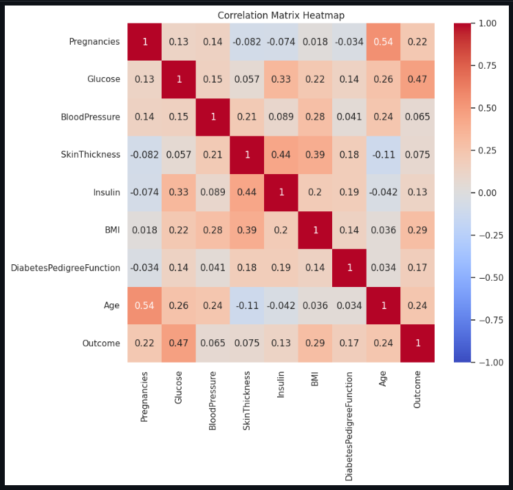
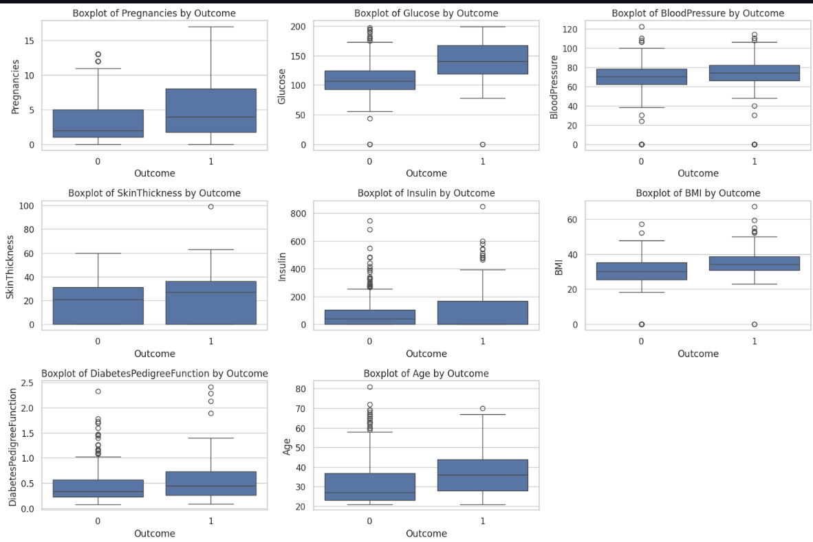

**Diabetes Prediction Model**

This project aims to predict the likelihood of diabetes in patients based on various health-related features. The dataset includes information such as pregnancies, glucose levels, blood pressure, skin thickness, insulin levels, BMI (Body Mass Index), diabetes pedigree function, age, and the presence of diabetes (the target variable). I explored different machine learning models and visualizations to understand the dataset and build an accurate predictive model.

**Models** 

 - Decision Tree Classifier
    I built a Decision Tree classifier to predict diabetes based on the input features. This model is interpretable and handles both numerical and categorical data effectively. I performed hyperparameter tuning using grid search with cross-validation to optimize the model's parameters.

 - Random Forest Classifier
    Additionally, I experimented with a Random Forest classifier, an ensemble learning method that combines multiple decision trees to improve predictive performance. I adjusted the hyperparameters to enhance the model's accuracy and generalization.

 - XGBoost Classifier
    Furthermore, I explored the XGBoost classifier, a poIrful gradient boosting algorithm known for its efficiency and performance. I fine-tuned the hyperparameters and utilized its capabilities to achieve high accuracy in diabetes prediction.

**Visualizations**

I conducted exploratory data analysis to gain insights into the dataset's characteristics. Visualizations such as histograms, box plots, and correlation matrices helped me understand the distribution of features, identify correlations, and detect patterns in the data.

**Model Evaluation**

I visualized the performance of each model using metrics such as accuracy, precision, recall, and F1-score. Additionally, I generated confusion matrices to analyze the model's predictions and evaluate its effectiveness in classifying patients as diabetic or non-diabetic.

**Feature Importance**

To understand the importance of features in predicting diabetes, I visualized feature importance scores obtained from the models. This helped us identify the most significant predictors and gain insights into the underlying factors contributing to diabetes risk.

**Conclusion**

In conclusion, this project demonstrates the effectiveness of machine learning models in predicting diabetes based on health-related features. By leveraging various algorithms and visualizations, I can make informed decisions and potentially contribute to early diagnosis and intervention for individuals at risk of diabetes.

